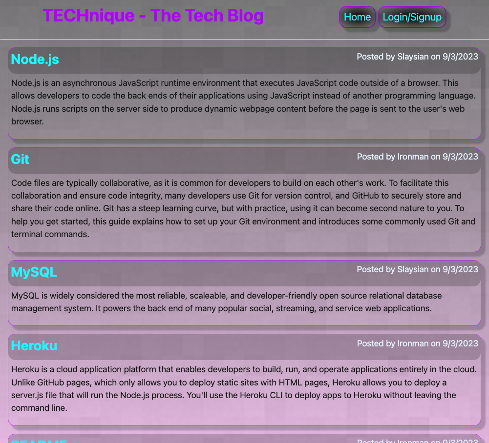
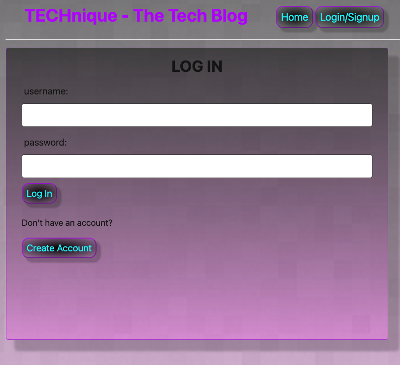
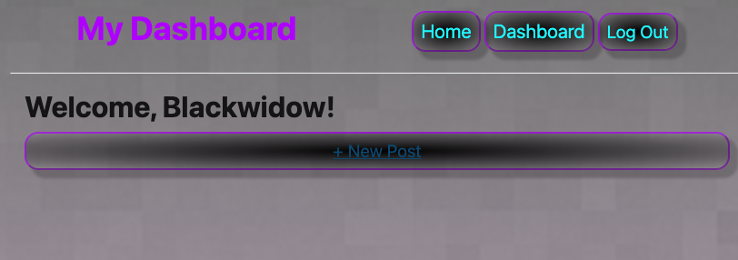
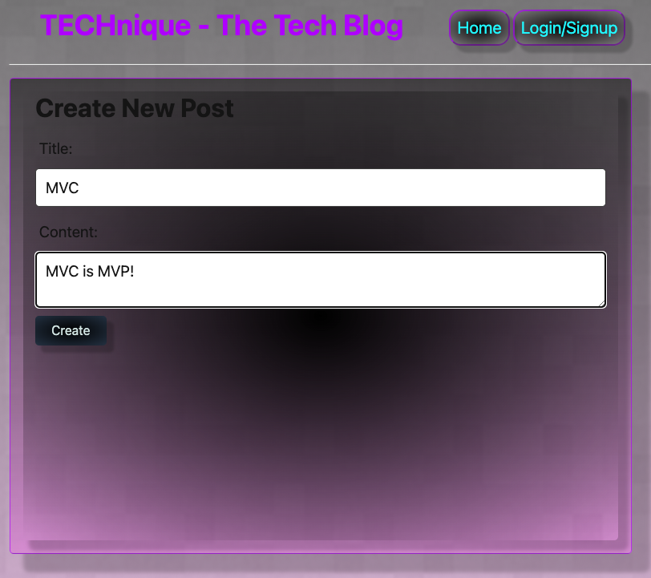
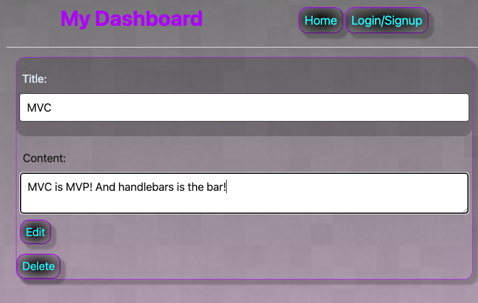
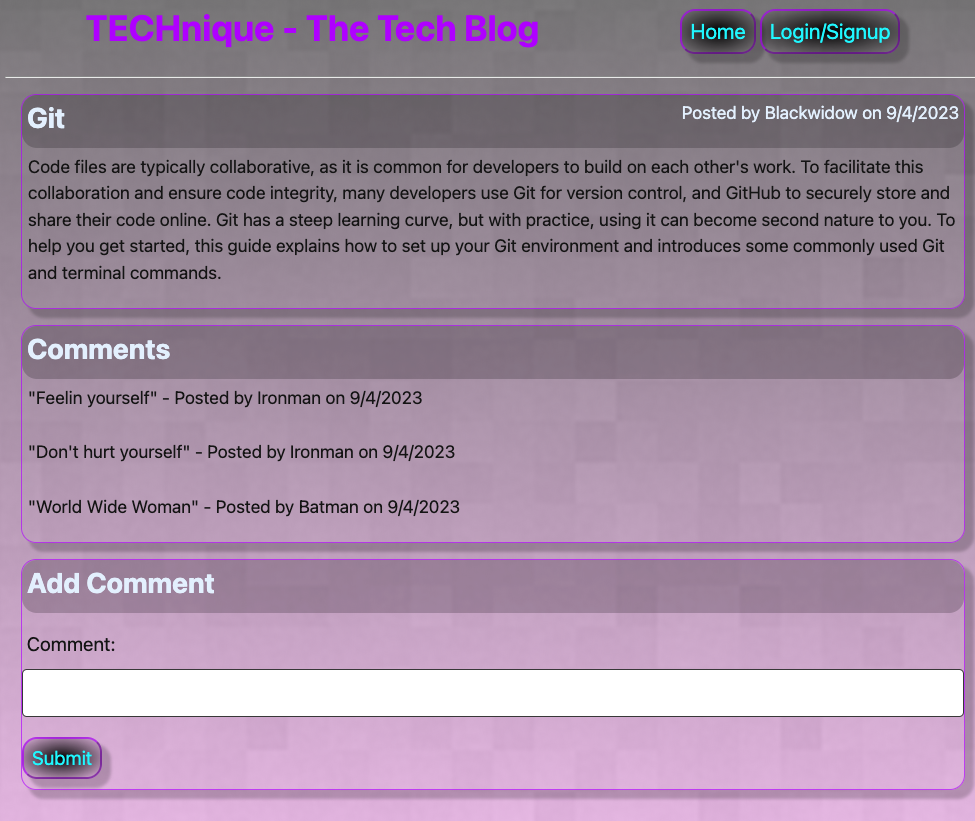

# TECHnique The Tech Blog Site

  

> ## DESCRIPTION
 A tech blog site where you can create a user account, view other users' blog posts and leave a comments, view and update your blog posts.

## TABLE OF CONTENTS
  1. [Description](#description)
  2. [Usage](#usage)
  3. [References](#references)
  4. [License](#license)
  5. [Contributing](#contributing)
  6. [Questions](#questions)

> ## USAGE
#### Sign up for the tech blog at [TECHnique - The Tech Blog](https://technique-d7b715dd2fa4.herokuapp.com/) 
#### View blog posts without an account   
#### In order to post blogs or leave comments, create an account or log in to an existing account.   
#### Once you've created an account or logged in, go to your dashboard to create a new post or view, edit, delete posts you've made.   
#### Click on the title of your post to edit or delete it.   
#### From the homepage, click on the title of a blog to leave a comment.   

> ## REFERENCES
- UDEMY Dr Angela Yu (https://appbrewery.com/)
- UDEMY Colt Steele - The Ultimate MySQL Bootcamp: Go from SQL Beginner to Expert (https://www.udemy.com/course/the-ultimate-mysql-bootcamp-go-from-sql-beginner-to-expert/)
- UDEMY Jonas Schmedtmann courses (https://codingheroes.io/resources/)
- W3Schools (https://www.w3schools.com/)
- UConn Coding Bootcamp - Module 14 MVC Lessions
- Blog content taken directly from The Full-Stack Blog (https://coding-boot-camp.github.io/full-stack/)

> ## LICENSE
 
Please see the LICENSE file for details

> ## CONTRIBUTING
#### If you are interested in contributing to this project, please follow these steps:
- Fork the repo on GitHub
- Clone the project to your own machine
- Commit changes to your own branch
- Push your work back up to your fork
- Submit a pull request for review

> ## QUESTIONS
For any questions, please reach out to me via [GitHub](https://github.com/SLAYsian).
